# Obsidian MCP Second Brain Server

An MCP (Model Context Protocol) server that provides intelligent **read-only** access to your Obsidian vault, enabling it to function as a "second brain" for LLMs.

## Features

- **Efficient Database Storage**: SQLite-based indexing for large vaults with persistent caching
- **Memory Mode Option**: Optional in-memory indexing for small vaults or development
- **Semantic Search**: Full-text search across all notes with fuzzy matching
- **Tag-Based Filtering**: Search by hierarchical tags (e.g., `work/puppet`, `tech/golang`)
- **Path-Based Filtering**: Filter by directory patterns (e.g., `Work/Puppet/**`)
- **Temporal Queries**: Filter notes by creation/modification dates
- **Metadata Filtering**: Filter by type, status, and category
- **Note Retrieval**: Get full content of specific notes
- **Smart Summarization**: Generate summaries of note collections
- **Recent Notes**: Quick access to recently modified notes
- **Archive Control**: Optionally include archived notes in searches
- **Security**: Path traversal protection, file size limits, input validation

## Read-Only Design

This MCP server is intentionally **read-only** to ensure your vault remains safe during AI interactions. It provides:
- ✅ Search and retrieve notes
- ✅ Filter by metadata and paths
- ✅ Generate summaries and statistics
- ❌ No note creation or editing
- ❌ No file modifications

For write operations, consider using dedicated Obsidian plugins with built-in safety checks.

## Installation

### Using npx (Recommended)

No installation needed! Use directly with npx:

```bash
npx -y @comfucios/obsidian-mcp-sb --vault-path "/path/to/your/vault"
```

### Local Development

```bash
cd obsidian-mcp-sb
npm install
npm run build
npm link
```

This makes the server available globally as `obsidian-mcp-sb`.

## Configuration

The server automatically detects your vault structure based on the standardized organization:

```
📁 Work/          - Professional context
📁 Projects/      - Personal projects
📁 Knowledge/     - Learning & references
📁 Life/          - Personal management
📁 Dailies/       - Journal entries
📁 Archive/       - Historical notes (excluded)
📁 _Meta/         - Vault management (excluded)
```

### Configuration via MCP JSON

All configuration can be done directly in your MCP configuration file using CLI arguments. No need to modify source code!

**Available CLI Arguments:**

| Argument | Type | Default | Description |
|----------|------|---------|-------------|
| `--vault-path` | string | **(required)** | Path to your Obsidian vault |
| `--use-memory` | flag | `false` | Use in-memory storage instead of database (for small vaults) |
| `--index-patterns` | string | `Work/**/*.md,Projects/**/*.md,Knowledge/**/*.md,Life/**/*.md,Dailies/**/*.md` | Comma-separated patterns to index |
| `--exclude-patterns` | string | `Archive/**/*.md,_Meta/Attachments/**,.trash/**,node_modules/**,.git/**` | Comma-separated patterns to exclude |
| `--metadata-fields` | string | `tags,type,status,category,created,modified` | Comma-separated frontmatter fields |
| `--max-file-size` | number | `10485760` | Maximum file size in bytes (10MB) |
| `--max-search-results` | number | `100` | Maximum search results to return |
| `--max-recent-notes` | number | `100` | Maximum recent notes to return |

**Example with custom configuration:**

```json
{
  "mcpServers": {
    "obsidian-sb": {
      "command": "npx",
      "args": [
        "-y",
        "@comfucios/obsidian-mcp-sb",
        "--vault-path", "/Users/username/Documents/Vault",
        "--index-patterns", "Work/**/*.md,Projects/**/*.md,Archive/**/*.md",
        "--exclude-patterns", ".trash/**,node_modules/**",
        "--max-search-results", "50",
        "--max-file-size", "5242880"
      ]
    }
  }
}
```

## MCP Tools

### 1. `search_notes`
Search notes with optional filters.

**Parameters:**
- `query` (string, optional): Search query text
- `tags` (array, optional): Filter by tags (e.g., `["work/puppet", "golang"]`)
- `type` (enum, optional): `note`, `project`, `task`, `daily`, `meeting`
- `status` (enum, optional): `active`, `archived`, `idea`, `completed`
- `category` (enum, optional): `work`, `personal`, `knowledge`, `life`, `dailies`
- `dateFrom` (string, optional): Start date (YYYY-MM-DD format, validated)
- `dateTo` (string, optional): End date (YYYY-MM-DD format, validated)
- `path` (string, optional): Filter by directory pattern (e.g., `"Work/Puppet/**"`)
- `includeArchive` (boolean, optional): Include archived notes (default: false)
- `limit` (number, optional): Max results (default: 20, max: configurable via `maxSearchResults`)

#### Search Flow Diagram

```mermaid
graph TD
    A[Search Query] --> B{Query Empty?}
    B -->|Yes| C[Get All Notes]
    B -->|No| D[Full-Text Search<br/>FTS5 or Fuse.js]

    C --> E[Apply Filters]
    D --> E

    E --> F{Path Filter?}
    F -->|Yes| G[Match Path Pattern<br/>Work/Puppet/** or Work/Puppet]
    F -->|No| H{Archive Filter?}
    G --> H

    H -->|includeArchive=false| I[Exclude archive/ paths]
    H -->|includeArchive=true| J{Tags Filter?}
    I --> J

    J -->|Yes| K[Hierarchical Tag Match<br/>work → work/puppet ✓<br/>work → homework ✗]
    J -->|No| L{Type Filter?}
    K --> L

    L -->|Yes| M[Filter by type<br/>note, project, task, etc.]
    L -->|No| N{Status Filter?}
    M --> N

    N -->|Yes| O[Filter by status<br/>active, archived, etc.]
    N -->|No| P{Category Filter?}
    O --> P

    P -->|Yes| Q[Filter by category<br/>work, personal, etc.]
    P -->|No| R{Date Filters?}
    Q --> R

    R -->|Yes| S[Filter by dateFrom/dateTo<br/>Validate YYYY-MM-DD]
    R -->|No| T[Sort by Recency<br/>modified → created]
    S --> T

    T --> U{Limit Set?}
    U -->|Yes| V[Take First N Results]
    U -->|No| W[Return All Results]
    V --> X[Return Results]
    W --> X

    style D fill:#4CAF50
    style K fill:#FF9800
    style S fill:#2196F3
    style T fill:#9C27B0
```



**Examples:**
```json
{
  "query": "docker deployment",
  "tags": ["tech/devops"],
  "status": "active",
  "limit": 10
}
```

```json
{
  "path": "Work/Puppet/**",
  "status": "active"
}
```

```json
{
  "query": "meeting notes",
  "includeArchive": true,
  "dateFrom": "2025-01-01"
}
```

### 2. `get_note`
Retrieve full content of a specific note.

**Parameters:**
- `path` (string, required): Note path (e.g., `"Work/Puppet/Meeting Notes.md"`)

### 3. `get_notes_by_tag`
Get all notes with a specific tag.

**Parameters:**
- `tag` (string, required): Tag to search (e.g., `"work/puppet"`)

### 4. `get_recent_notes`
Get recently modified notes.

**Parameters:**
- `limit` (number, optional): Number of notes (default: 10, max: configurable via `maxRecentNotes`)

### 5. `list_tags`
List all unique tags across the vault.

### 6. `summarize_notes`
Generate summary statistics for notes matching criteria.

**Parameters:**
- `tags` (array, optional): Filter by tags
- `type` (enum, optional): Filter by type
- `status` (enum, optional): Filter by status
- `category` (enum, optional): Filter by category

**Returns:**
```json
{
  "total": 58,
  "byType": { "note": 40, "meeting": 18 },
  "byStatus": { "active": 45, "archived": 13 },
  "byCategory": { "work": 58 },
  "recentlyModified": [...]
}
```

## Usage with Claude Code

Add to your MCP configuration file.

### Single Vault Configuration

**macOS/Linux:** Edit `~/Library/Application Support/Claude/claude_desktop_config.json`
**Windows:** Edit `%APPDATA%\Claude\claude_desktop_config.json`

```json
{
  "mcpServers": {
    "obsidian-sb": {
      "command": "npx",
      "args": [
        "-y",
        "@comfucios/obsidian-mcp-sb",
        "--vault-path",
        "/Users/ioanniskarasavvaidis/Documents/Obsidian Vault"
      ]
    }
  }
}
```

### Multiple Vault Configuration

You can configure multiple vault instances:

```json
{
  "mcpServers": {
    "obsidian-personal": {
      "command": "npx",
      "args": [
        "-y",
        "@comfucios/obsidian-mcp-sb",
        "--vault-path",
        "/Users/username/Documents/Personal Vault"
      ]
    },
    "obsidian-work": {
      "command": "npx",
      "args": [
        "-y",
        "@comfucios/obsidian-mcp-sb",
        "--vault-path",
        "/Users/username/Documents/Work Vault"
      ]
    }
  }
}
```

### Local Development Setup

If you're developing locally with `npm link`:

```json
{
  "mcpServers": {
    "obsidian-sb": {
      "command": "obsidian-mcp-sb",
      "args": [
        "--vault-path",
        "/path/to/your/vault"
      ]
    }
  }
}
```

## Example Queries

### Find Active Puppet Work (Path Filtering)
```json
{
  "tool": "search_notes",
  "path": "Work/Puppet/**",
  "status": "active"
}
```

### Get Recent Meeting Notes
```json
{
  "tool": "search_notes",
  "type": "meeting",
  "limit": 5
}
```

### Find Project Ideas (Excluding Archive)
```json
{
  "tool": "search_notes",
  "category": "projects",
  "status": "idea"
}
```

### Search Coffee Recipes
```json
{
  "tool": "search_notes",
  "query": "aeropress",
  "tags": ["coffee"]
}
```

### Historical Search (Include Archive)
```json
{
  "tool": "search_notes",
  "query": "project retrospective",
  "includeArchive": true,
  "dateFrom": "2024-01-01",
  "dateTo": "2024-12-31"
}
```

### Get Work Summary
```json
{
  "tool": "summarize_notes",
  "category": "work"
}
```

## Frontmatter Requirements

All notes should include YAML frontmatter for optimal functionality:

```yaml
---
created: 2025-10-04
modified: 2025-10-04
tags: [tech/ai, project/active]
type: note
status: active
category: knowledge
---
```

## Search Weights

The server uses weighted search scoring for semantic search:

- **Title**: 3.0x
- **Tags**: 2.5x
- **Frontmatter** (type, status, category): 2.0x
- **Content**: 1.0x
- **Recency Boost**: 1.5x (applied to all results)

This means searching for "meeting" will match notes with `type: meeting` higher than notes containing "meeting" in their content.

## Security Features

This server implements multiple security measures:

- **Path Traversal Protection**: All file paths are validated using `path.relative()` to ensure they remain within the vault directory
- **File Size Limits**: Files exceeding `maxFileSize` (default 10MB) are skipped during indexing to prevent memory issues
- **Input Validation**: All enum parameters (type, status, category) are strictly validated
- **Date Validation**: Date strings are validated for format and actual date validity (e.g., rejects Feb 30)
- **Error Tracking**: Failed file reads are logged without exposing sensitive system paths

## Development

```bash
# Install dependencies
npm install

# Watch mode (auto-rebuild on changes)
npm run watch

# Build
npm run build

# Start server
npm start

# Run tests
npm test

# Run tests with coverage
npm test:coverage

# Lint code
npm run lint

# Auto-fix lint issues
npm run lint:fix
```

## Contributing

When contributing to this project:

1. **Write tests** for new features in `src/__tests__/`
2. **Run linting** with `npm run lint` before committing
3. **Ensure all tests pass** with `npm test`
4. **Update documentation** if adding/changing features
5. **Follow TypeScript strict mode** - no `any` types allowed

## Storage Architecture

The server uses **SQLite database storage by default** for efficient indexing and persistent caching:

- **Database Mode (Default)**: Stores indexed notes in `.obsidian-mcp/notes.db` within your vault
  - Persistent indexing (survives server restarts)
  - Efficient for large vaults (1000+ notes)
  - Full-text search with SQLite FTS5
  - Lower memory usage

- **Memory Mode (Optional)**: Use `--use-memory` flag for in-memory storage
  - Faster for small vaults (<100 notes)
  - No disk I/O overhead
  - Useful for development and testing
  - Uses Fuse.js for fuzzy search

### Architecture Diagram


### Database Schema (SQLite Mode)


**Indexes:**
- `idx_notes_modified`: Fast recency queries
- `idx_notes_type`, `idx_notes_status`, `idx_notes_category`: Fast metadata filtering
- `idx_note_tags_tag`, `idx_note_tags_path`: Fast tag lookups and hierarchical matching
- `notes_fts`: Full-text search with porter stemming for natural language queries

**Example with memory mode:**
```json
{
  "mcpServers": {
    "obsidian-sb": {
      "command": "npx",
      "args": [
        "-y",
        "@comfucios/obsidian-mcp-sb",
        "--vault-path", "/path/to/vault",
        "--use-memory"
      ]
    }
  }
}
```

## Architecture

- **`src/index.ts`**: MCP server implementation with tool handlers
- **`src/vault.ts`**: Vault indexing orchestration and security controls
- **`src/storage.ts`**: Storage interface abstraction
- **`src/database-storage.ts`**: SQLite-based storage implementation
- **`src/memory-storage.ts`**: In-memory storage implementation with Fuse.js
- **`src/storage-factory.ts`**: Storage factory pattern for mode selection
- **`src/config.ts`**: Configuration management with defaults
- **`src/types.ts`**: TypeScript type definitions and validation utilities
- **`src/__tests__/`**: Unit tests for critical functionality

## Dependencies

**Production:**
- `@modelcontextprotocol/sdk`: MCP protocol implementation
- `better-sqlite3`: Fast SQLite database for efficient indexing
- `gray-matter`: YAML frontmatter parsing
- `glob`: File pattern matching for vault indexing
- `fuse.js`: Fuzzy search functionality (memory mode)

**Development:**
- `typescript`: Type safety and compilation
- `eslint`: Code linting with TypeScript support
- `jest`: Testing framework with TypeScript integration
- `ts-jest`: Jest TypeScript preprocessor

## License

MIT
